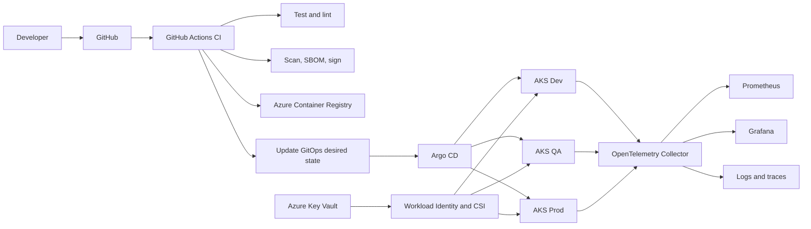

# Enterprise AKS GitOps Platform

[](https://github.com/harshilamin/enterprise-aks-gitops-platform/actions/workflows/repository-ci.yml)
[](https://github.com/harshilamin/enterprise-aks-gitops-platform/actions/workflows/docs-ci.yml)
[](LICENSE)

A production-inspired Kubernetes application platform demonstrating secure delivery to Azure Kubernetes Service using Helm, Argo CD, GitOps, workload identity, OpenTelemetry, scaling, and progressive delivery.

## Relationship to Repository 1

```text
terraform-azure-enterprise-infrastructure
       |
       | Provisions Azure, networking, AKS, ACR,
       | Key Vault, identity, monitoring, governance
       v
enterprise-aks-gitops-platform
       |
       | Packages, deploys, secures, observes,
       | scales, promotes, and rolls back workloads
       v
AKS application platform
```

Repository 1 creates the cloud foundation. Repository 2 manages application delivery and Kubernetes operations.

## Planned capabilities

- Secure FastAPI sample service
- Multi-stage non-root container
- Reusable Helm chart
- Argo CD GitOps
- Dev, QA, and Production promotion
- Immutable image-digest promotion
- AKS workload identity
- Azure Key Vault CSI integration
- OpenTelemetry using OTLP
- Prometheus and Grafana
- Horizontal and event-driven scaling
- NetworkPolicy and pod-security controls
- Canary and blue/green delivery
- Automated rollback
- Supply-chain security

## Architecture



## Repository structure

```text
.
├── apps/sample-api/
├── charts/sample-api/
├── gitops/
│   ├── applications/
│   ├── projects/
│   └── environments/{dev,qa,prod}/
├── platform/
│   ├── argocd/
│   ├── observability/
│   ├── policies/
│   └── secrets/
├── docs/
├── diagrams/
├── scripts/
├── tests/
└── .github/workflows/
```

## GitOps principle

CI produces and verifies immutable artifacts. Git stores desired state. Argo CD reconciles that desired state with AKS.

The same image digest is promoted through Dev, QA, and Production. It is not rebuilt for each environment.

## Release roadmap

| Release | Scope |
|---|---|
| v1.0.0 | Foundation, architecture, governance, documentation |
| v1.1.0 | Secure containerized FastAPI service |
| v1.2.0 | Reusable Helm chart |
| v1.3.0 | Argo CD GitOps and environment promotion |
| v1.4.0 | Workload identity and Key Vault |
| v1.5.0 | OpenTelemetry, Prometheus, Grafana |
| v1.6.0 | Scaling, resilience, and network security |
| v1.7.0 | Progressive delivery and rollback |
| v1.8.0 | Supply-chain security and policy |
| v2.0.0 | Final integrated platform |

## v1.0.0 scope

This release establishes the architecture, repository skeleton, ADRs, documentation site, governance, and baseline CI. Application and Kubernetes implementation begin in v1.1.0.

## Local validation

```powershell
powershell.exe -ExecutionPolicy Bypass -File .\scripts\validate-foundation.ps1
python -m mkdocs build --strict
```

## Interview summary

> Repository 1 provisions AKS and Azure platform services. Repository 2 demonstrates how I package, secure, deploy, observe, scale, and promote applications on that platform using GitOps.

## Author

**Harshil Amin** — Senior DevOps Engineer
