# Enterprise AKS GitOps Platform

[](https://github.com/harshilamin/enterprise-aks-gitops-platform/actions/workflows/repository-ci.yml)
[](https://github.com/harshilamin/enterprise-aks-gitops-platform/actions/workflows/app-ci.yml)
[](https://github.com/harshilamin/enterprise-aks-gitops-platform/actions/workflows/helm-ci.yml)
[](https://github.com/harshilamin/enterprise-aks-gitops-platform/actions/workflows/gitops-ci.yml)
[](https://github.com/harshilamin/enterprise-aks-gitops-platform/actions/workflows/identity-ci.yml)
[](https://github.com/harshilamin/enterprise-aks-gitops-platform/actions/workflows/docs-ci.yml)
[](https://github.com/harshilamin/enterprise-aks-gitops-platform/releases)
[](LICENSE)

A production-inspired Kubernetes application platform demonstrating secure delivery to Azure Kubernetes Service using Helm, Argo CD, Microsoft Entra Workload ID, Azure Key Vault, observability, scaling, and progressive delivery.

## Current release — v1.4.0

v1.4.0 introduces passwordless Azure secret access:

- Microsoft Entra Workload ID ServiceAccount annotations
- Required AKS Workload Identity pod label
- User-assigned managed identity bootstrap
- Federated identity credential creation
- Azure Key Vault Secrets Provider add-on enablement
- Least-privilege `Key Vault Secrets User` assignment
- Namespaced `SecretProviderClass`
- Read-only Secrets Store CSI mount
- No secret values in Git, Helm output, or Kubernetes Secrets
- Dev, QA, and Production identity rendering
- Values generation and GitOps merge automation
- Six unit tests and dedicated identity CI

## Platform progression

```text
Repository 1
Azure infrastructure, AKS, networking, Key Vault, private endpoints
                              |
                              v
v1.1.0  Secure FastAPI workload and container
                              |
                              v
v1.2.0  Helm and Kubernetes security controls
                              |
                              v
v1.3.0  Argo CD GitOps and immutable promotion
                              |
                              v
v1.4.0  Workload Identity and Azure Key Vault CSI
```

## Identity flow

```mermaid
flowchart LR
    Pod[Sample API Pod] --> Token[Projected ServiceAccount token]
    Token --> OIDC[AKS OIDC issuer]
    OIDC --> Entra[Microsoft Entra token exchange]
    Entra --> Identity[User-assigned managed identity]
    Identity --> RBAC[Key Vault Secrets User]
    RBAC --> KeyVault[Azure Key Vault]
    KeyVault --> CSI[Azure Key Vault CSI provider]
    CSI --> Files[Read-only mounted files]
```



## Helm configuration

```yaml
workloadIdentity:
  enabled: true
  clientId: "11111111-1111-1111-1111-111111111111"
  tenantId: "22222222-2222-2222-2222-222222222222"
  serviceAccountTokenExpirationSeconds: 3600

azureKeyVault:
  enabled: true
  name: kv-sample-api-dev
  cloudName: ""
  mountPath: /mnt/secrets-store
  objects:
    - objectName: sample-api-signing-key
      objectVersion: ""
      objectAlias: signing-key
```

The chart adds:

```text
ServiceAccount annotations
azure.workload.identity/client-id
azure.workload.identity/tenant-id
azure.workload.identity/service-account-token-expiration

Pod label
azure.workload.identity/use: "true"

CSI driver
secrets-store.csi.k8s.io

Custom resource
secrets-store.csi.x-k8s.io/v1 / SecretProviderClass
```

## Security decisions

- No service principal password or certificate
- No secret value in repository files
- No `secretObjects` synchronization
- No Kubernetes `Secret` rendered
- Read-only CSI volume and mount
- Azure RBAC required
- Read-only `Key Vault Secrets User`
- Exact federated subject per namespace and ServiceAccount
- Existing non-root and read-only container controls remain active

## Local validation

Install:

```powershell
.\.venv\Scripts\Activate.ps1

python -m pip install -e ".[dev]"
python -m pip install -r requirements-docs.txt
python -m pip install -r requirements-helm.txt
python -m pip install -r requirements-gitops.txt
python -m pip install -r requirements-identity.txt
```

Validate identity integration:

```powershell
powershell.exe -ExecutionPolicy Bypass `
  -File .\scripts\validate-identity.ps1
```

Validate the entire release:

```powershell
powershell.exe -ExecutionPolicy Bypass `
  -File .\scripts\validate-v1.4.0.ps1
```

## Azure bootstrap

```powershell
powershell.exe -ExecutionPolicy Bypass `
  -File .\platform\identity\bootstrap-workload-identity.ps1 `
  -SubscriptionId "<subscription-id>" `
  -ResourceGroup "<resource-group>" `
  -ClusterName "<aks-cluster>" `
  -IdentityName "id-sample-api-dev" `
  -KeyVaultName "kv-sample-api-dev" `
  -Environment dev `
  -SecretNames @("sample-api-signing-key")
```

The default output is a non-secret values overlay under:

```text
.rendered/workload-identity/dev.yaml
```

Use `-MergeGitOps` only after reviewing the output and Azure resources.

## GitOps enablement

The ApplicationSet continues to read:

```text
charts/sample-api/values-<environment>.yaml
gitops/environments/<environment>/values.yaml
```

The generator can merge Workload Identity and Key Vault identifiers into the environment GitOps values while preserving the promoted image reference.

## CI controls

Workload Identity CI:

- Tests values generation
- Lints identity-enabled Helm composition
- Renders Dev, QA, and Production
- Reuses the base workload security assertions
- Validates identity annotations and pod labels
- Validates the CSI mount and `SecretProviderClass`
- Rejects Kubernetes Secret synchronization
- Validates built-in Kubernetes schemas
- Uploads rendered manifests

No Azure credentials are required for static CI.

## Release roadmap

| Release | Scope | Status |
|---|---|---|
| v1.0.0 | Foundation and architecture | Complete |
| v1.1.0 | Secure containerized FastAPI service | Complete |
| v1.2.0 | Helm and Kubernetes controls | Complete |
| v1.3.0 | Argo CD GitOps and promotion | Complete |
| v1.4.0 | Workload Identity and Key Vault | Complete |
| v1.5.0 | OpenTelemetry, Prometheus, and Grafana | Next |
| v1.6.0 | Scaling, resilience, and advanced networking | Planned |
| v1.7.0 | Progressive delivery and rollback | Planned |
| v1.8.0 | Supply-chain security and policy | Planned |
| v2.0.0 | Final integrated platform | Planned |

## Honest scope

This release implements the Kubernetes, Helm, GitOps, Azure CLI bootstrap, validation, and documentation layers.

A live environment still requires:

- Azure subscription and permissions
- AKS cluster
- Key Vault using Azure RBAC
- Existing Key Vault secret objects
- Network connectivity to Key Vault
- Production ownership of Azure resources in Repository 1 Terraform

## Interview summary

> The pod has no Azure password. AKS issues a projected ServiceAccount token, Microsoft Entra validates it through the cluster OIDC issuer, a user-assigned identity receives least-privilege Key Vault access, and the CSI provider mounts the permitted secrets as read-only files.

## Author

**Harshil Amin**  
Senior DevOps Engineer
