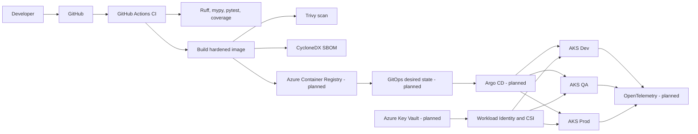

# Enterprise AKS GitOps Platform

[](https://github.com/harshilamin/enterprise-aks-gitops-platform/actions/workflows/repository-ci.yml)
[](https://github.com/harshilamin/enterprise-aks-gitops-platform/actions/workflows/app-ci.yml)
[](https://github.com/harshilamin/enterprise-aks-gitops-platform/actions/workflows/docs-ci.yml)
[](https://github.com/harshilamin/enterprise-aks-gitops-platform/releases)
[](LICENSE)

A production-inspired Kubernetes application platform demonstrating secure delivery to Azure Kubernetes Service using Helm, Argo CD, GitOps, workload identity, OpenTelemetry, scaling, and progressive delivery.

## Current release — v1.1.0

v1.1.0 adds a secure containerized FastAPI reference workload with:

- Python 3.14.6 local and container baseline
- Python 3.12 and 3.14 CI compatibility testing
- Liveness, readiness, and startup endpoints
- Structured JSON logging
- Request correlation
- Security response headers
- Strict environment validation
- Production API-documentation hardening
- Graceful application lifecycle
- Ruff, mypy, pytest, and coverage gates
- Multi-stage non-root container image
- Read-only runtime and dropped Linux capabilities
- Container smoke testing
- Trivy vulnerability scanning
- CycloneDX SBOM generation

## Relationship to Repository 1

```text
terraform-azure-enterprise-infrastructure
       |
       | Provisions Azure, networking, AKS, ACR,
       | Key Vault, identity, monitoring, governance
       v
enterprise-aks-gitops-platform
       |
       | Packages, deploys, secures, observes,
       | scales, promotes, and rolls back workloads
       v
AKS application platform
```

Repository 1 creates the cloud foundation. Repository 2 manages application delivery and Kubernetes operations.

## Architecture



## Secure sample API

Source:

```text
apps/sample-api/src/sample_api/
```

Tests:

```text
apps/sample-api/tests/
```

### Endpoints

| Endpoint | Purpose |
|---|---|
| `/` | Service metadata |
| `/health/live` | Liveness probe |
| `/health/ready` | Readiness probe |
| `/health/startup` | Startup probe |
| `/api/v1/info` | Runtime information |
| `/docs` | Non-production API documentation |

Production disables `/docs` and `/openapi.json`.

## Local development with Python 3.14.6

```powershell
py -3.14 -m venv .venv
.\.venv\Scripts\Activate.ps1

python -m pip install --upgrade pip
python -m pip install -e ".[dev]"

powershell.exe -ExecutionPolicy Bypass `
  -File .\scripts\validate-app.ps1
```

Run the API:

```powershell
.\scripts\run-app.ps1
```

Open:

```text
http://127.0.0.1:8080
http://127.0.0.1:8080/docs
```

## Container execution

Build:

```powershell
.\scripts\build-image.ps1
```

Run the hardened Compose definition:

```powershell
docker compose up --build
```

The Compose runtime uses:

- UID and GID `10001`
- Read-only root filesystem
- `tmpfs` for `/tmp`
- All Linux capabilities dropped
- `no-new-privileges`
- Graceful shutdown period
- Container health check

## Application CI

Pull requests run:

1. Python 3.12 and 3.14 dependency installation
2. Ruff formatting
3. Ruff linting
4. Strict mypy checks
5. pytest with at least 90% coverage
6. Hardened Docker build
7. Running-container health checks
8. Trivy HIGH/CRITICAL reporting with a CRITICAL vulnerability gate
9. CycloneDX SBOM generation

## GitOps principle

CI produces and verifies immutable artifacts. Git stores desired state. Argo CD reconciles that desired state with AKS.

The same image digest will be promoted through Dev, QA, and Production. It will not be rebuilt for each environment.

## Release roadmap

| Release | Scope | Status |
|---|---|---|
| v1.0.0 | Foundation, architecture, governance, documentation | Complete |
| v1.1.0 | Secure containerized FastAPI service | Complete |
| v1.2.0 | Reusable Helm chart | Next |
| v1.3.0 | Argo CD GitOps and environment promotion | Planned |
| v1.4.0 | Workload identity and Key Vault | Planned |
| v1.5.0 | OpenTelemetry, Prometheus, Grafana | Planned |
| v1.6.0 | Scaling, resilience, and network security | Planned |
| v1.7.0 | Progressive delivery and rollback | Planned |
| v1.8.0 | Supply-chain security and policy | Planned |
| v2.0.0 | Final integrated platform | Planned |

## Honest scope

The application, container security, automated tests, image scanning, and SBOM generation are implemented in this release.

Helm, Argo CD, ACR publishing, workload identity, Key Vault, OpenTelemetry, Kubernetes scaling, and progressive delivery remain future releases and are not claimed as implemented yet.

## Interview summary

> Repository 1 provisions AKS and Azure platform services. Repository 2 demonstrates how I package, secure, test, deploy, observe, scale, and promote applications on that platform using GitOps.

## Author

**Harshil Amin**  
Senior DevOps Engineer
