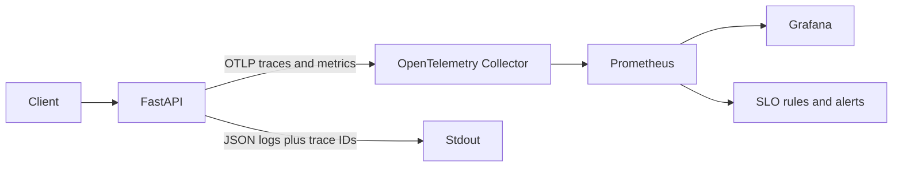

# Enterprise AKS GitOps Platform

A production-inspired Kubernetes application platform demonstrating secure delivery to Azure Kubernetes Service using Helm, Argo CD, Microsoft Entra Workload ID, Azure Key Vault, OpenTelemetry, Prometheus, Grafana, and SLO-based operations.

## Current release — v1.5.0

v1.5.0 adds a complete vendor-neutral observability path:

- OpenTelemetry Python API and SDK `1.42.1`
- OTLP/HTTP trace and metric export
- Official OpenTelemetry Collector contrib `0.157.0`
- Prometheus metric exposition
- Collector internal telemetry
- `ServiceMonitor`
- Grafana dashboard sidecar discovery
- Availability and latency recording rules
- Fast and slow multi-window error-budget alerts
- Trace-correlated JSON logs
- Environment-specific sampling
- Dedicated observability CI

## Signal flow



## Application metrics

```text
http.server.request.count
http.server.request.duration
http.server.active_requests
```

The Collector translates these into Prometheus-compatible names under the `sample_api` namespace.

## SLOs

| Objective | Default |
|---|---:|
| Availability | 99.5% |
| Error budget | 0.5% |
| p95 latency | 0.5 seconds |
| Fast burn | 14.4x, 5m and 1h |
| Slow burn | 6x, 30m and 6h |

## Secure telemetry design

- No request or response bodies
- No authorization headers or cookies
- No query strings in telemetry
- No raw paths in Prometheus labels
- Trace-correlated logs and response header
- Pinned Collector image
- Non-root, read-only Collector
- OTLP restricted to the application namespace
- Prometheus scraping restricted to the monitoring namespace
- Grafana administrator password stored outside Git

## Local validation

```powershell
.\.venv\Scripts\Activate.ps1
python -m pip install -e ".[dev]"
python -m pip install -r requirements-docs.txt
python -m pip install -r requirements-helm.txt
python -m pip install -r requirements-gitops.txt
python -m pip install -r requirements-identity.txt
python -m pip install -r requirements-observability.txt

python -m ruff format --check .
python -m ruff check .

powershell.exe -ExecutionPolicy Bypass `
  -File .\scripts\validate-observability.ps1

powershell.exe -ExecutionPolicy Bypass `
  -File .\scripts\validate-v1.5.0.ps1
```

## Monitoring stack

The repository includes a manual Argo CD Application for `kube-prometheus-stack` `86.0.0`.

```powershell
powershell.exe -ExecutionPolicy Bypass `
  -File .\platform\observability\create-grafana-admin-secret.ps1

powershell.exe -ExecutionPolicy Bypass `
  -File .\platform\observability\bootstrap-observability.ps1
```

## Release progression

| Release | Scope | Status |
|---|---|---|
| v1.0.0 | Foundation | Complete |
| v1.1.0 | Secure FastAPI workload | Complete |
| v1.2.0 | Helm and Kubernetes controls | Complete |
| v1.3.0 | Argo CD GitOps and promotion | Complete |
| v1.4.0 | Workload Identity and Key Vault | Complete |
| v1.5.0 | OpenTelemetry, Prometheus, Grafana, and SLOs | Complete |
| v1.6.0 | Scaling, resilience, and advanced networking | Next |
| v1.7.0 | Progressive delivery | Planned |
| v1.8.0 | Supply-chain security and policy | Planned |
| v2.0.0 | Final integrated platform | Planned |

## Honest scope

This release sends traces to the Collector debug exporter rather than a durable trace backend. Metrics and SLOs are production-oriented, while trace storage remains an explicit future integration point.

## Author

**Harshil Amin**  
Senior DevOps Engineer
