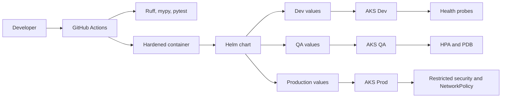

# Enterprise AKS GitOps Platform

[](https://github.com/harshilamin/enterprise-aks-gitops-platform/actions/workflows/repository-ci.yml)
[](https://github.com/harshilamin/enterprise-aks-gitops-platform/actions/workflows/app-ci.yml)
[](https://github.com/harshilamin/enterprise-aks-gitops-platform/actions/workflows/helm-ci.yml)
[](https://github.com/harshilamin/enterprise-aks-gitops-platform/actions/workflows/docs-ci.yml)
[](https://github.com/harshilamin/enterprise-aks-gitops-platform/releases)
[](LICENSE)

A production-inspired Kubernetes application platform demonstrating secure delivery to Azure Kubernetes Service using Helm, Argo CD, GitOps, workload identity, OpenTelemetry, scaling, and progressive delivery.

## Current release — v1.2.0

v1.2.0 packages the secure FastAPI workload as a reusable Helm chart with:

- Dev, QA, and Production values
- Kubernetes startup, liveness, and readiness probes
- Restricted pod and container security contexts
- CPU and memory requests and limits
- HorizontalPodAutoscaler using `autoscaling/v2`
- PodDisruptionBudget using `policy/v1`
- NetworkPolicy using `networking.k8s.io/v1`
- Optional Ingress
- Topology spread constraints
- Rolling-update and graceful-termination controls
- Helm test Pod
- JSON Schema validation
- Helm lint, render, invariant, and Kubernetes-schema checks
- Packaged chart artifact from CI

## Repository progression

```text
Repository 1: Terraform provisions Azure and AKS
                       |
Repository 2 v1.1.0: Secure application and container
                       |
Repository 2 v1.2.0: Helm packaging and Kubernetes controls
                       |
Repository 2 v1.3.0: Argo CD GitOps and promotion
```

## Application architecture



## Helm chart

```text
charts/sample-api/
├── Chart.yaml
├── values.yaml
├── values.schema.json
├── values-dev.yaml
├── values-qa.yaml
├── values-prod.yaml
└── templates/
    ├── deployment.yaml
    ├── service.yaml
    ├── service-account.yaml
    ├── config-map.yaml
    ├── hpa.yaml
    ├── pod-disruption-budget.yaml
    ├── network-policy.yaml
    ├── ingress.yaml
    └── tests/test-connection.yaml
```

## Environment model

| Capability | Dev | QA | Production |
|---|---:|---:|---:|
| HPA minimum | 1 | 2 | 3 |
| HPA maximum | 3 | 5 | 10 |
| PDB | Disabled | Minimum 1 | Minimum 2 |
| CPU request | 50m | 100m | 250m |
| Memory request | 64Mi | 128Mi | 256Mi |
| Log level | DEBUG | INFO | INFO |
| NetworkPolicy | Enabled | Enabled | Enabled |
| Rolling unavailable | 0 | 0 | 0 |

## Local validation with Python 3.14.6

Install Helm on Windows:

```powershell
winget install --id Helm.Helm --exact
```

Restart PowerShell, then verify:

```powershell
helm version
```

Install validation dependencies:

```powershell
.\.venv\Scripts\Activate.ps1
python -m pip install -r requirements-helm.txt
```

Run the complete release validation:

```powershell
powershell.exe -ExecutionPolicy Bypass `
  -File .\scripts\validate-v1.2.0.ps1
```

## Render Production

```powershell
helm template sample-api .\charts\sample-api `
  --namespace sample-api-prod `
  --values .\charts\sample-api\values-prod.yaml
```

## Install into a connected cluster

```powershell
helm upgrade --install sample-api .\charts\sample-api `
  --namespace sample-api-dev `
  --create-namespace `
  --values .\charts\sample-api\values-dev.yaml `
  --atomic `
  --wait
```

A connected cluster is not required for portfolio validation.

## Security posture

- Runs as UID and GID `10001`
- Requires non-root execution
- Uses `RuntimeDefault` seccomp
- Disables privilege escalation
- Drops all Linux capabilities
- Uses a read-only root filesystem
- Disables service-account token automount
- Disables Kubernetes service-link environment injection
- Defines requests and limits
- Applies ingress and egress NetworkPolicy controls
- Uses immutable image-digest support for later GitOps promotion

## Release roadmap

| Release | Scope | Status |
|---|---|---|
| v1.0.0 | Foundation and architecture | Complete |
| v1.1.0 | Secure containerized FastAPI service | Complete |
| v1.2.0 | Reusable Helm chart and Kubernetes controls | Complete |
| v1.3.0 | Argo CD GitOps and environment promotion | Next |
| v1.4.0 | Workload identity and Key Vault | Planned |
| v1.5.0 | OpenTelemetry, Prometheus, Grafana | Planned |
| v1.6.0 | Scaling, resilience, and advanced network security | Planned |
| v1.7.0 | Progressive delivery and rollback | Planned |
| v1.8.0 | Supply-chain security and policy | Planned |
| v2.0.0 | Final integrated platform | Planned |

## Honest scope

The application, container, Helm packaging, probes, resource controls, HPA, PDB, NetworkPolicy, chart tests, and manifest validation are implemented.

Argo CD, ACR publishing, workload identity, Key Vault, OpenTelemetry, KEDA, and progressive delivery remain future releases.

## Interview summary

> Repository 1 provisions AKS and Azure platform services. Repository 2 now demonstrates how I build a secure application, package it with Helm, and apply Kubernetes reliability and security controls before introducing GitOps promotion.

## Author

**Harshil Amin**  
Senior DevOps Engineer
