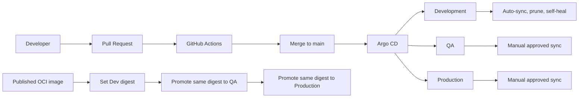

# Enterprise AKS GitOps Platform

[](https://github.com/harshilamin/enterprise-aks-gitops-platform/actions/workflows/repository-ci.yml)
[](https://github.com/harshilamin/enterprise-aks-gitops-platform/actions/workflows/app-ci.yml)
[](https://github.com/harshilamin/enterprise-aks-gitops-platform/actions/workflows/helm-ci.yml)
[](https://github.com/harshilamin/enterprise-aks-gitops-platform/actions/workflows/gitops-ci.yml)
[](https://github.com/harshilamin/enterprise-aks-gitops-platform/actions/workflows/docs-ci.yml)
[](https://github.com/harshilamin/enterprise-aks-gitops-platform/releases)
[](LICENSE)

A production-inspired Kubernetes application platform demonstrating secure delivery to Azure Kubernetes Service using Helm, Argo CD, GitOps, workload identity, observability, scaling, and progressive delivery.

## Current release — v1.3.0

v1.3.0 introduces the GitOps delivery layer:

- Restricted Argo CD AppProject
- ApplicationSet for Dev, QA, and Production
- Development automatic sync, prune, and self-heal
- QA and Production manual synchronization
- GitOps-controlled image values
- Digest-aware image promotion
- Enforced Dev → QA → Production promotion order
- Drift detection and Git-based rollback
- Argo CD bootstrap scripts
- GitOps CI and generated Application artifacts
- Local static validation without requiring a cluster

## Repository progression

```text
Repository 1
Terraform provisions Azure, AKS, networking, identity, and shared services
                              |
                              v
Repository 2 v1.1.0
Secure FastAPI workload and hardened container
                              |
                              v
Repository 2 v1.2.0
Reusable Helm chart and Kubernetes controls
                              |
                              v
Repository 2 v1.3.0
Argo CD GitOps, drift detection, and environment promotion
```

## GitOps architecture



## Argo CD resources

```text
gitops/
├── projects/
│   └── sample-api-project.yaml
├── applicationsets/
│   └── sample-api.yaml
├── bootstrap/
│   └── README.md
└── environments/
    ├── dev/
    │   └── values.yaml
    ├── qa/
    │   └── values.yaml
    └── prod/
        └── values.yaml
```

## AppProject security boundary

The AppProject restricts:

- Source repository
- Destination cluster
- Exact Dev, QA, and Production namespaces
- Namespaced Kubernetes resource kinds
- Cluster-scoped resources except `sample-api-*` Namespaces

The project also warns about orphaned resources.

## ApplicationSet behavior

One list generator creates:

| Application | Namespace | Sync policy |
|---|---|---|
| `sample-api-dev` | `sample-api-dev` | Automatic |
| `sample-api-qa` | `sample-api-qa` | Manual |
| `sample-api-prod` | `sample-api-prod` | Manual |

The ApplicationSet enables Go templates with missing-key errors and conditionally adds automated synchronization only for Development.

## Helm values composition

Argo CD renders the chart using two environment layers:

```text
charts/sample-api/values-<environment>.yaml
gitops/environments/<environment>/values.yaml
```

The chart values define sizing and Kubernetes behavior. The GitOps values define the image reference and may override runtime environment settings.

## Immutable image promotion

Set the first Development digest:

```powershell
.\scripts\promote-image.ps1 `
  -Command set `
  -Environment dev `
  -ImageRepository example.azurecr.io/enterprise-aks-sample-api `
  -Digest sha256:<64-hexadecimal-characters>
```

Promote Dev to QA:

```powershell
.\scripts\promote-image.ps1 `
  -Command promote `
  -FromEnvironment dev `
  -ToEnvironment qa
```

Promote QA to Production:

```powershell
.\scripts\promote-image.ps1 `
  -Command promote `
  -FromEnvironment qa `
  -ToEnvironment prod
```

The script clears the mutable tag and copies the exact repository and digest. Promotion cannot skip QA.

## Local validation with Python 3.14.6

Install dependencies:

```powershell
.\.venv\Scripts\Activate.ps1
python -m pip install -r requirements-gitops.txt
```

Validate GitOps:

```powershell
powershell.exe -ExecutionPolicy Bypass `
  -File .\scripts\validate-gitops.ps1
```

Run the complete release validation:

```powershell
powershell.exe -ExecutionPolicy Bypass `
  -File .\scripts\validate-v1.3.0.ps1
```

## Optional live Argo CD bootstrap

A live cluster is not required for portfolio validation.

After v1.3.0 is merged into `main` and the application image is available from the target cluster:

```powershell
powershell.exe -ExecutionPolicy Bypass `
  -File .\platform\argocd\bootstrap\install-argocd.ps1

powershell.exe -ExecutionPolicy Bypass `
  -File .\platform\argocd\bootstrap\bootstrap-gitops.ps1
```

The installation script pins Argo CD `v3.4.2`.

## GitOps CI

The workflow validates:

- AppProject restrictions
- ApplicationSet generation
- Sync-policy separation
- Image value invariants
- Promotion order
- Promotion unit tests
- Helm composition for all three environments
- Workload security and reliability invariants
- Kubernetes schemas
- Generated Application artifacts
- Rendered desired-state artifacts

## Drift and rollback

Development automatically repairs live drift.

QA and Production show drift but require explicit synchronization.

Rollback is performed by reverting the Git commit, merging the rollback pull request, and synchronizing the affected environment. Git remains the deployment audit trail.

## Release roadmap

| Release | Scope | Status |
|---|---|---|
| v1.0.0 | Foundation and architecture | Complete |
| v1.1.0 | Secure containerized FastAPI service | Complete |
| v1.2.0 | Helm and Kubernetes controls | Complete |
| v1.3.0 | Argo CD GitOps and promotion | Complete |
| v1.4.0 | Workload identity and Key Vault | Next |
| v1.5.0 | OpenTelemetry, Prometheus, Grafana | Planned |
| v1.6.0 | Scaling, resilience, advanced networking | Planned |
| v1.7.0 | Progressive delivery and rollback | Planned |
| v1.8.0 | Supply-chain security and policy | Planned |
| v2.0.0 | Final integrated platform | Planned |

## Honest scope

The release implements Argo CD project and ApplicationSet manifests, environment desired state, digest-promotion automation, static validation, and CI rendering.

A live deployment still requires:

- A Kubernetes cluster
- Argo CD
- A registry image reachable from that cluster
- Organization-specific RBAC and approvals
- A real ACR, GHCR, or other OCI digest

Workload identity, Key Vault, OpenTelemetry, KEDA, and progressive delivery remain later releases.

## Interview summary

> Repository 1 provisions AKS. Repository 2 builds and packages the workload, then uses Git as the desired-state source and Argo CD as the reconciler. Development moves automatically, while QA and Production use reviewed digest promotion and explicit synchronization.

## Author

**Harshil Amin**  
Senior DevOps Engineer
