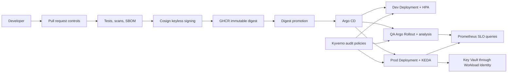

# Final v2.0.0 Platform Architecture

## Environment design

| Environment | Delivery | Scaling | Approval |
|---|---|---|---|
| Development | Deployment | HPA | Automatic Argo CD sync |
| QA | Argo Rollout canary | HPA | Manual sync and metric analysis |
| Production | Deployment | KEDA Prometheus scaler | Manual sync and immutable digest |

The environments deliberately demonstrate separate patterns rather than enabling every controller against the same scale target.
