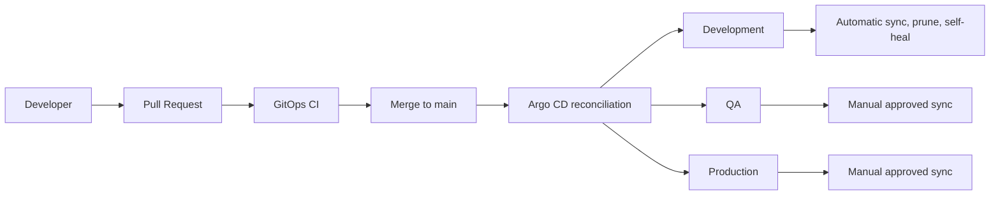

# GitOps Architecture

## Control flow

## Repository contract

The ApplicationSet reads:

- The reusable chart from `charts/sample-api`
- Environment sizing from `charts/sample-api/values-<environment>.yaml`
- Image desired state from `gitops/environments/<environment>/values.yaml`

The GitOps values file has higher Helm precedence and therefore controls the image reference used by each environment.

## Generated Applications

The list generator creates:

- `sample-api-dev`
- `sample-api-qa`
- `sample-api-prod`

All three target the in-cluster Kubernetes API but use isolated namespaces.

## Synchronization model

Development automatically synchronizes, prunes removed resources, and repairs live drift.

QA and Production remain manually synchronized. Git changes make them `OutOfSync`, but deployment still requires an explicit approval and sync action.

## Safety

The ApplicationSet preserves workload resources when the ApplicationSet itself is deleted. The AppProject restricts source repositories, destination namespaces, namespaced resource kinds, and cluster-scoped access to `sample-api-*` Namespaces only.
