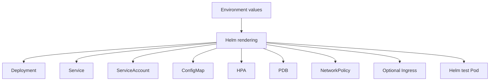

# Helm Chart Architecture

## Purpose

The Helm chart converts the v1.1.0 application and container into reusable Kubernetes desired state.

## Resource model

## Design principles

- One chart is reused across Dev, QA, and Production.
- Environment differences live in values files rather than copied templates.
- The chart supports image tags for local use and immutable digests for GitOps promotion.
- Kubernetes-native stable API versions are used.
- Security and reliability controls are enabled by default.
- Secrets are not stored in values or ConfigMaps.

## Chart validation

CI performs four layers:

1. `helm lint --strict`
2. `helm template`
3. Python security and reliability assertions
4. Kubeconform schema validation
