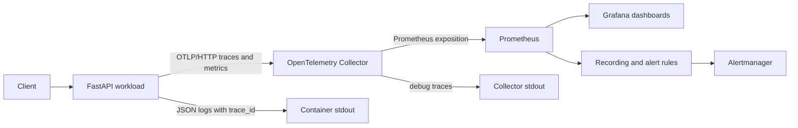

# Observability Architecture

## Signal flow



## Application instrumentation

The application creates isolated OpenTelemetry tracer and meter providers. It emits:

- `http.server.request.count`
- `http.server.request.duration`
- `http.server.active_requests`
- Server spans for inbound requests

Metrics use route templates such as `/api/v1/items/{item_id}` rather than raw URLs. Query strings, request IDs, and user identifiers are excluded to control cardinality.

## OTLP transport

The workload sends OTLP/HTTP protobuf to the Collector on port `4318`:

```text
/v1/traces
/v1/metrics
```

The Collector also exposes OTLP/gRPC on `4317` for future workloads.

## Collector pipelines

The release pins the official contrib distribution to `0.157.0`.

Trace pipeline:

```text
otlp -> memory_limiter -> resource -> batch -> debug
```

Metric pipeline:

```text
otlp -> memory_limiter -> resource -> batch -> prometheus
```

The debug trace exporter is intentionally non-durable. A later integration can replace it with Tempo, Azure Monitor, Datadog, or another OTLP backend without changing application instrumentation.

## Metrics and dashboards

The Collector exports application metrics on `8889` and its own telemetry on `8888`. A `ServiceMonitor` exposes both endpoints to Prometheus.

A Grafana dashboard ConfigMap is discovered by the kube-prometheus-stack dashboard sidecar.

## Environment sampling

| Environment | Trace sample ratio |
|---|---:|
| Development | 1.0 |
| QA | 0.5 |
| Production | 0.1 |

Parent-based sampling preserves upstream sampling decisions.
