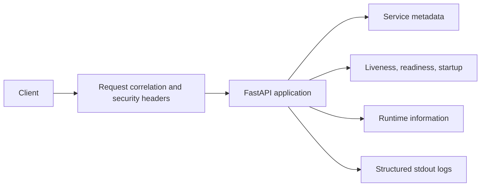

# Secure Sample API Architecture

## Purpose

The sample API is intentionally small so the repository can focus on platform engineering rather than business-domain complexity.

## Runtime flow

## Application factory

`create_app()` allows tests to create isolated application instances with explicit settings.

## Health model

- Liveness confirms that the process can serve requests.
- Readiness confirms that the application is ready to receive traffic.
- Startup confirms that initialization completed.

The Helm release will map these endpoints to Kubernetes probes.

## Configuration

Configuration is read from environment variables and validated at startup. Invalid environments, log levels, empty names, and empty versions fail fast.

## Production behavior

Interactive OpenAPI documentation is disabled when `APP_ENVIRONMENT=production`.
