# AKS Workload Identity Architecture

## Trust flow

```mermaid
flowchart LR
    Pod[Sample API Pod] --> SAT[Projected ServiceAccount token]
    SAT --> OIDC[AKS OIDC issuer]
    OIDC --> Entra[Microsoft Entra token exchange]
    Entra --> UAMI[User-assigned managed identity]
    UAMI --> RBAC[Key Vault Secrets User]
    RBAC --> KV[Azure Key Vault]
    KV --> CSI[Azure Key Vault CSI provider]
    CSI --> Mount[Read-only files in /mnt/secrets-store]
```



## Kubernetes identity

The Helm chart annotates the ServiceAccount with:

- `azure.workload.identity/client-id`
- `azure.workload.identity/tenant-id`
- `azure.workload.identity/service-account-token-expiration`

The pod template includes:

```text
azure.workload.identity/use: "true"
```

The cluster's Workload Identity webhook uses that label to inject the projected token configuration.

## Federated identity credential

The Azure user-assigned managed identity trusts exactly one Kubernetes subject:

```text
system:serviceaccount:<namespace>:<service-account>
```

Each environment uses a different namespace and therefore should use its own federated credential.

## Secret retrieval

The `SecretProviderClass` contains:

- Managed identity client ID
- Tenant ID
- Key Vault name
- Secret object names and optional aliases

It does not contain secret values.

The node-level CSI provider authenticates with the projected workload token, retrieves the allowed Key Vault objects, and mounts them as read-only files.

## Repository boundaries

Repository 1 owns AKS, networking, OIDC, Key Vault, and Azure infrastructure.

Repository 2 owns:

- ServiceAccount annotations
- Pod label
- `SecretProviderClass`
- CSI volume and mount
- GitOps configuration
- Bootstrap and verification automation

The bootstrap script is included for portfolio and lab use. In a production platform, the Azure resources and role assignments should be managed through Repository 1 Terraform.
